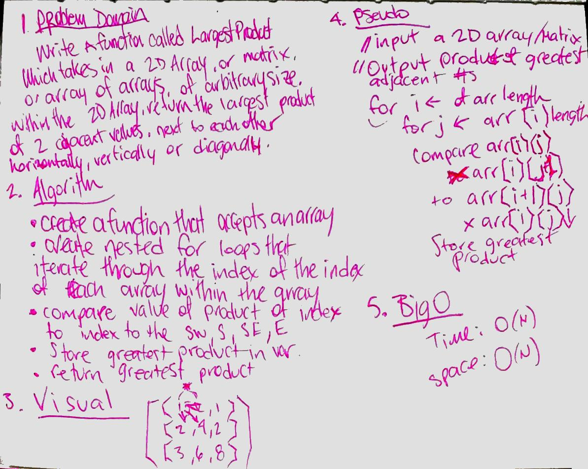

# Largest product of 2 adjacent values in a 2D array
write a function called largestProduct which takes in a 2D array/ matrix of any size, and find the largest product of 2 adjacent values

## Challenge
the values can be adjacent vertically, horizontally, or diagonally. no use of built in array functions

## Solution

