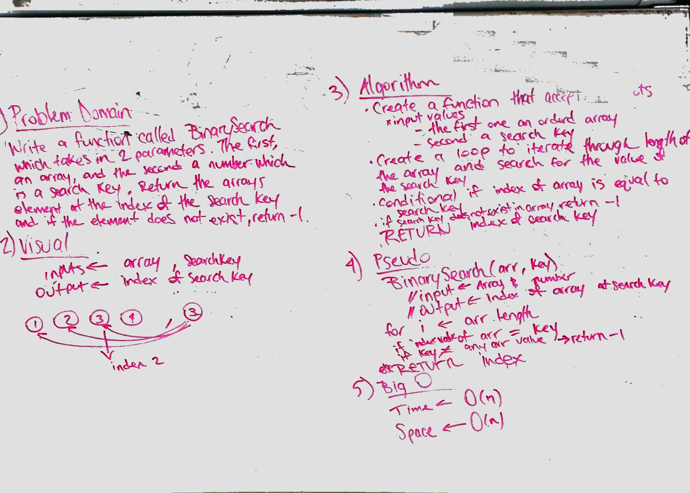

# Binary Search
Write a function called Binary search which takes in an array and a number. Find in the array the number that matches that search key number and return the index of it. If the number does not exist in the array, return -1.

## Challenge
Do not use any built in array methods.

## Solution

