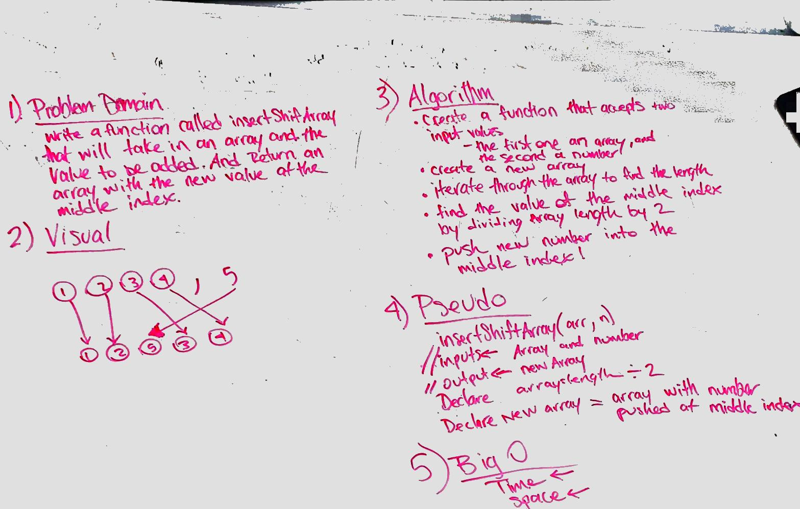

# Insert and shift middle index of array
write a function called insertShiftArray that takes in two values, one an array and one number. insert the number into the middle of the array.

## Challenge
basically creating the splice() array method without using any built in methods.

## Solution

