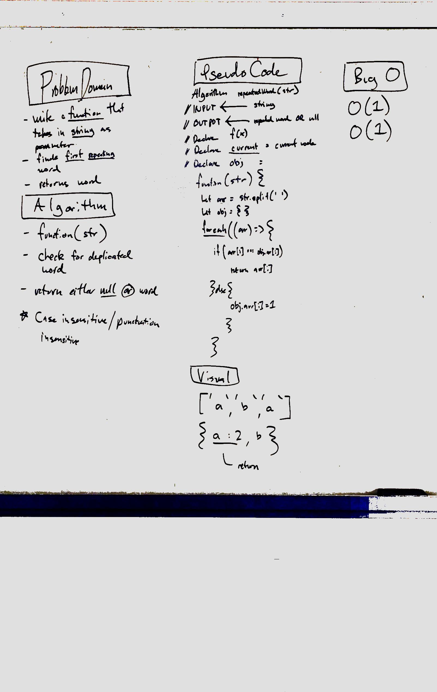

# First repeated word
Write a function that accepts a lengthy string parameter.
return the first repeated word

## Challenge
Without utilizing any of the built-in library methods available to your language, return the first word to occur more than once in that provided string.

## Solution

