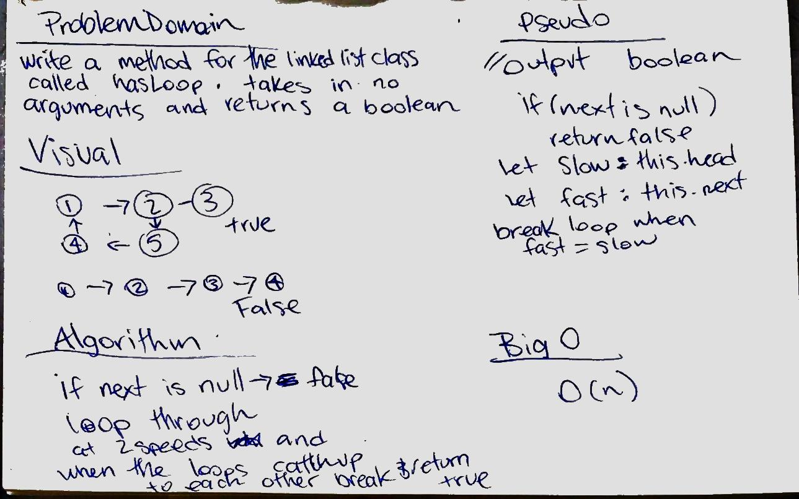

# Identify a Circular Reference
write a method for the LInked list class called hasLoop() which takes in no arguments and returns a boolean

## Challenge
Use no additional memory or modify the nodes

## Solution
