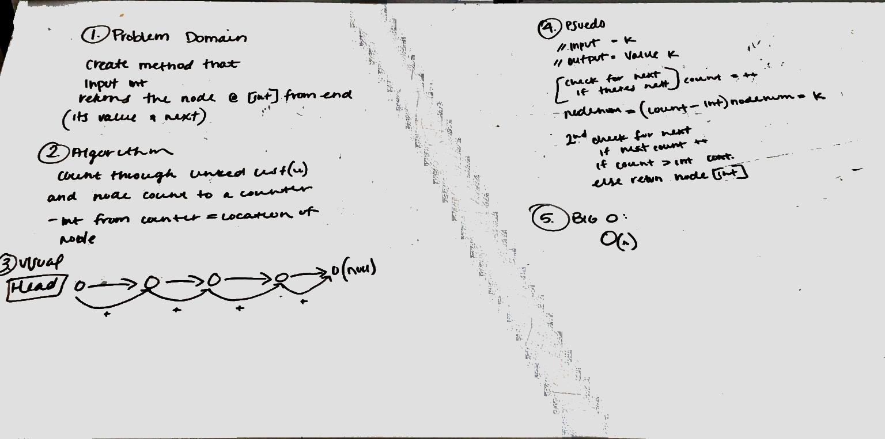

# kth from the end of a Linked List
<!-- Short summary or background information -->
Write a method for the Linked List class which takes a number, k, as a parameter. Return the node that is k from the end of the linked list. You have access to the Node class and all the properties on the Linked List class as well as the methods created in previous challenges. ​​

## Challenge
<!-- Description of the challenge -->
testing
​
## Solution
<!-- Embedded whiteboard image -->
​
