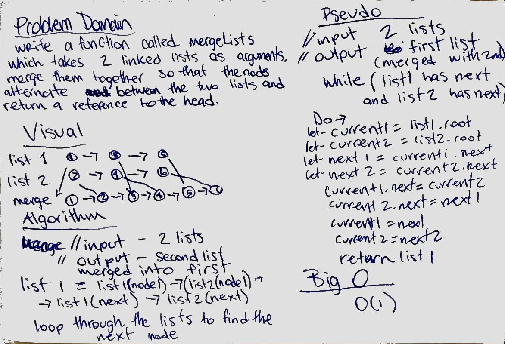

# Merge two Linked Lists
write a function called mergeLists to merge two linked lists with the node values alternating. return the head of the single list

## Challenge
keep the space down to O(1)

## Solution

