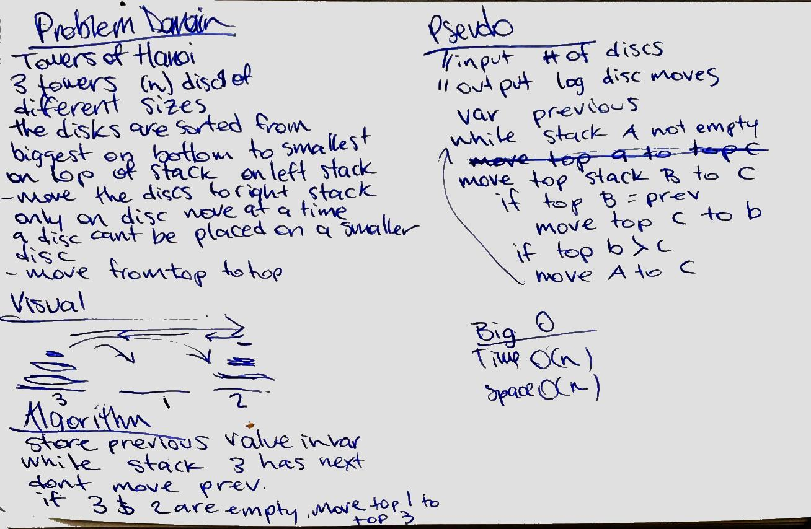

# Towers of Hanoi
3 towers o (n) discs, sorted from biggest on bottom to smallest on top
move the stack to furthest to the right stack. one disc at a time. 
no bigger disc on top of smaller disc

## Challenge
log every move from stack to stack

## Solution
​
